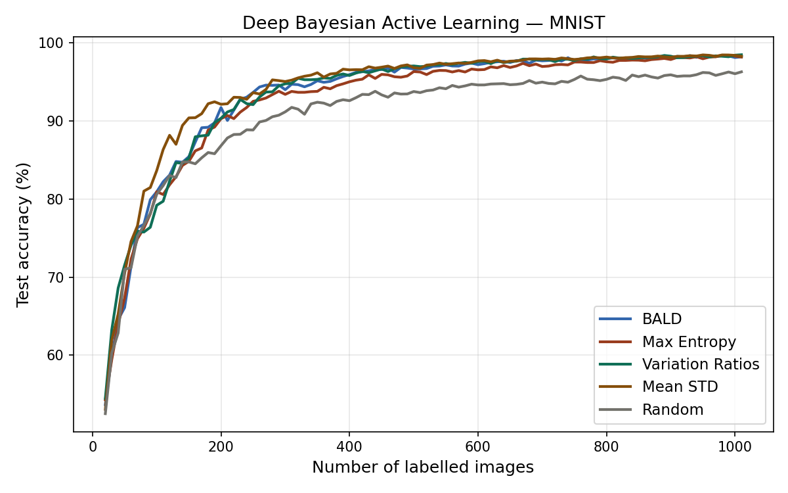
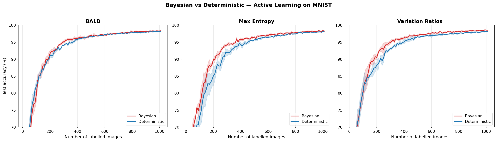
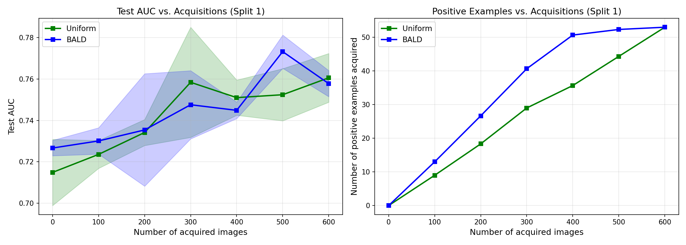
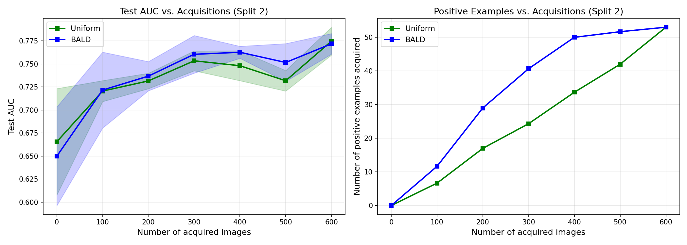

# Deep Bayesian Active Learning with Image Data

This repository aims at reproducing the experimental results of the paper ["Deep Bayesian Active Learning with Image Data"](https://arxiv.org/abs/1703.02910) using JAX and Flax. 

By leveraging the speed and vectorization capabilities of JAX, this project implements a framework for training Bayesian Convolutional Neural Networks (BCNNs) and utilizing their uncertainty estimates to perform efficient active learning.

## 🎯 Project Objectives

As outlined in the original scope, this repository is built to:
* Reproduce experimental results by training and evaluating Bayesian CNNs.
* Implement various active learning strategies.
* Evaluate and compare the performance of these active learning strategies over time.

---

## 🚀 Features & Acquisition Functions

The codebase supports several acquisition strategies to query the most informative unlabelled samples. These are implemented in `model/learning_loop.py`:

- BALD (Bayesian Active Learning by Disagreement): Maximizes mutual information (epistemic uncertainty).
- Max Entropy: Maximizes predictive entropy (total uncertainty).
- Variation Ratios: Maximizes dispersion (1 - max predicted probability).
- Mean STD: Maximizes the average standard deviation across classes over MC samples.
- Random: A uniform random baseline for comparison.

By default, the active learning loop evaluates acquisitions over 3 independent repetitions to provide statistically averaged test accuracy and loss.

---

## 🛠️ Implementation Details

The codebase relies on Monte Carlo (MC) Dropout to approximate Bayesian inference. 

### Core Components

- **Bayesian CNN** (`libs/network.py`): A Flax-based Convolutional Neural Network with interleaved Dropout layers. Keeping `deterministic=False` during inference allows us to sample from the approximate posterior.
- **Training & Optimization** (`model/train.py`): Uses standard Cross-Entropy Loss with Optax's adamw optimizer. The weight decay directly corresponds to the prior variance in the Bayesian formulation.
- **Vectorized Uncertainty** (`libs/utils.py`): Employs `jax.vmap` to elegantly parallelize stochastic forward passes (MC Dropout) across multiple PRNG keys without hitting Out-Of-Memory (OOM) errors.
- **Active Learning Loop** (`model/learning_loop.py`): Implements the oracle loop. At each step, the model is optionally reset, trained to convergence on the labelled set, and the acquisition function is used to score the remaining unlabelled pool.

---

## 📂 Repository Structure

```text
├── main.py                   # CLI entry point for MNIST, data loading, and plotting logic
├── main_isic.py              # CLI entry point for ISIC dataset
├── requirements.txt          # Project dependencies
├── libs/
│   ├── network.py            # Flax definition of the BayesianCNN and VGG16 modules
│   ├── loss.py               # Standard and custom loss functions + metrics
│   ├── isic_loader.py        # Dataloader for the ISIC dataset
│   └── utils.py              # jax.vmap MC Dropout logic and uncertainty math
└── model/
    ├── learning_loop.py      # Acquisition functions, pool scoring, and active learning loop
    └── train.py              # JAX-compiled train_step, eval_step, and epoch training function
```

---

## 🚀 Setup & Installation

We recommend using a Conda environment to manage dependencies:

```bash
conda create -n bcnn-al python=3.10
conda activate bcnn-al
pip install -r requirements.txt
```

*Note: For GPU support, check the instructions in `requirements.txt` to install the correct `jaxlib` for your CUDA version.*

---

## 🧪 Experiments

This repository reproduces two main sets of experiments from the paper: active learning on the MNIST dataset, and cancer diagnosis on the ISIC 2016 dataset. All scripts designed to automatically reproduce these experiments are located in the `experiments` directory.

### 1. MNIST Experiments

The first set of experiments evaluates various acquisition functions and the importance of model uncertainty using the MNIST dataset.

#### Usage

The entry point for the active learning pipeline on MNIST is `main.py`. It comes with a robust Command Line Interface (CLI) to configure the active learning parameters, neural network and training loops.

**Basic Run**

To run a standard active learning loop using the BALD acquisition function:

```bash
python main.py --acquisition bald
```

**Comparing Multiple Strategies**

To compare multiple acquisition functions and plot them together:

```bash
python main.py --acquisition bald max_entropy random
```

**Reproducing the Paper**

To run all available acquisition functions (reproducing Figure 1 of the paper):

```bash
python main.py --acquisition all
```

**Key CLI arguments**

| Argument | Default | Description |
| :-------- | :------- | :----------- |
|`--acquisition` | `bald`	| Function(s) to run: `bald`, `max_entropy`, `variation_ratios`, `mean_std`, `random`, or `all`. |
|`--n_steps`	| `100`	| Number of active learning acquisition rounds. |
|`--n_acquisitions` |	`10` |Number of images acquired from the pool per step. |
|`--n_per_class`	|`2`|	Initial labelled examples per class (starts with 20 total for MNIST). |
|`--num_mc_samples`|	`10` | Number of MC dropout forward passes for uncertainty estimation. |
|`--n_epochs`	| `200`	| Training epochs per acquisition step. |
|`--weight_decay`	| `1e-4` | L2 regularisation (prior precision). |
|`--dropout_prob`	|`0.5`|Dropout probability for the Bayesian CNN. |
|`--patience` | `10`| Early stopping patience: stop training if loss does not improve for this many consecutive epochs. |
|`--min_delta` | `1e-4` | Minimum loss improvement to count as progress for early stopping. |
|`--model_type`| `bayesian` | Whether to run a Bayesian CNN (dropout enabled) or Deterministic CNN (dropout disabled everywhere). |
|`--no_reset`	|`False`	|Pass to disable resetting model weights between acquisition steps. |
|`--output_dir`	|`results/`	|Directory to save the output history JSON and plots. |

Run `python main.py --help` for the full list of arguments.

#### 📊 Results on MNIST

**Comparison of Acquisition Functions**  
Active learning on MNIST using the Bayesian CNN with various acquisition functions. The theoretically grounded methods (BALD, Variation Ratios, Max Entropy) significantly outperform the Random baseline.



**Importance of Model Uncertainty**  
Comparing the Bayesian CNN (which captures epistemic uncertainty via MC dropout) against a deterministic CNN baseline. Propagating uncertainty allows the model to avoid uninformative samples and converge faster.



---

### 2. ISIC 2016 Experiment (Cancer Diagnosis)

We also reproduce the second experiment from the paper, which involves applying the active learning pipeline to a smaller, unbalanced medical dataset: **ISBI 2016 Skin Lesion Analysis Towards Melanoma Detection**.

#### Setup and Running

1. **Dependencies**: 
   Ensure you have installed the additional dependencies required for data processing and metric calculation:
   ```bash
   pip install pandas scikit-learn opencv-python requests
   ```
2. **Run the Experiment**:
   We have created a dedicated main script `main_isic.py` which handles:
   - Downloading and preparing the dataset (~900 images).
   - Loading pre-trained `torchvision` weights into a custom JAX/Flax VGG16 model with MC Dropout.
   - Using dynamic data augmentation (random flips) for the positive (malignant) examples during training.
   - Logging the Area-Under-the-Curve (AUC) and the number of positive samples acquired.
   
   Run the script with:
   ```bash
   python main_isic.py --output_dir results_isic
   ```
3. **Plotting**:
   To generate the plots for AUC and Positive Samples Acquired vs. Number of Acquisitions:
   ```bash
   python plot_isic.py --input_json results_isic/isic_results.json --output_dir results_isic
   ```

#### 📊 Results on ISIC

Applying the pipeline to the unbalanced ISIC 2016 dataset using a fine-tuned VGG16 model. BALD consistently queries more informative, minority-class (malignant) examples compared to a uniform baseline.

**Random Split 1:**  


**Random Split 2:**  


*Note: As highlighted in the paper, exact AUC values vary significantly depending on the random split due to the small, imbalanced nature of the dataset.*

---

## ✍️ Authors

* **Dario Gosmar** - [GitHub Profile](https://github.com/d4darius)
* **Andrea Gaudino** - [GitHub Profile](https://github.com/andreaGaudino)

## 📄 Acknowledgments

This project is an implementation based on the theoretical foundations presented in the following research:

[**Deep Bayesian Active Learning with Image Data**](https://arxiv.org/abs/1703.02910) Yarin Gal, Riashat Islam, and Zoubin Ghahramani (2017)
